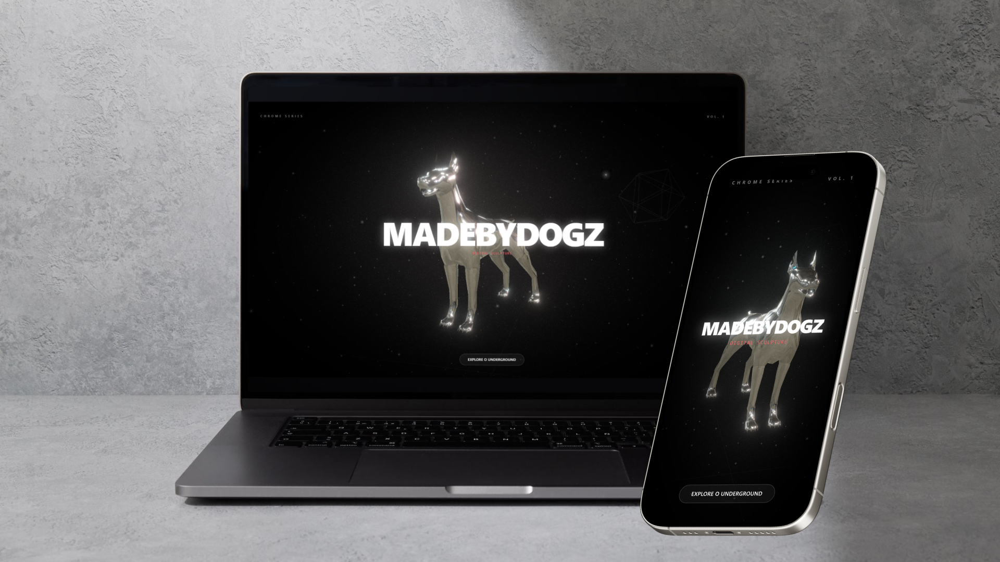
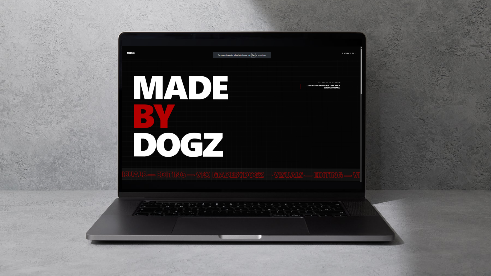
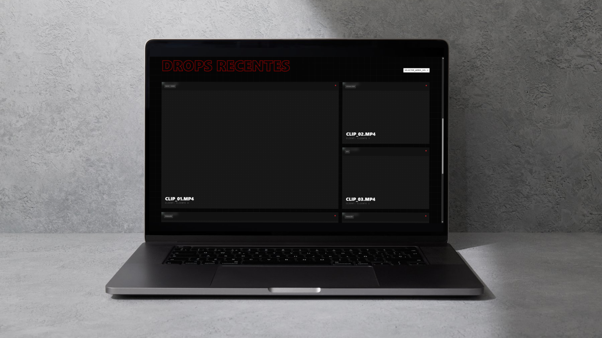

# 🎥 MADEBYDOGZ | Audiovisual Portfolio

[](https://madebydogz-portfolio-demo-hasjjtwpe-fabio-pennas-projects.vercel.app/)

> _"Underground Culture & Visuals"_

## 🏴 Sobre o Projeto

O **MADEBYDOGZ** é o site oficial de portfólio de uma produtora audiovisual independente focada na estética urbana, videoclipes de **Rap/Trap** e cultura underground.

O objetivo deste projeto frontend foi criar uma experiência imersiva que reflete a identidade visual da marca: agressiva, moderna e cinematográfica. O site serve como vitrine para os trabalhos da produtora, permitindo que artistas e clientes visualizem o reel e entrem em contato.

## ⚡ Funcionalidades & UX

- **Estética Urbana/Dark:** Design focado no modo escuro (Dark Mode) com acentos em neon/contraste.
- **Galeria de Projetos:** Exibição de videoclipes e trabalhos recentes (integração visual com YouTube/Vimeo).
- **Interatividade:** Micro-interações, efeitos de hover e transições suaves.
- **Responsividade:** Layout totalmente adaptado para mobile (onde a maioria do público da cena consome conteúdo).
- **Performance:** Carregamento otimizado de imagens e assets.

## 🛠 Tecnologias Utilizadas

Este projeto é **100% Frontend**, construído com tecnologias modernas para garantir fluidez e manutenibilidade.

- **Core:** [React](https://reactjs.org/) (via [Vite](https://vitejs.dev/))
- **Estilização:** [Tailwind CSS](https://tailwindcss.com/)
- **Ícones:** [Lucide React](https://lucide.dev/) / Heroicons
- **Animações:** Framer Motion
- **Deploy:** Vercel

## 📸 Prévias (Screenshots)







## 🚀 Como Rodar Localmente

Clone o projeto e siga os passos abaixo:

1.  **Instale as dependências:**

    ```bash
    npm install
    ```

2.  **Rode o servidor de desenvolvimento:**

    ```bash
    npm run dev
    ```

3.  **Acesse:**
    O projeto estará rodando em `http://localhost:5173`.

---

Desenvolvido por **Fábio Penna**.
